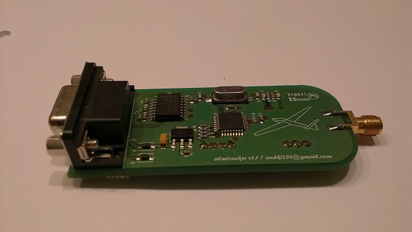

Allmogetracker 1
================

Allmogetrackern är ett projekt som vi har arbetat med sedan hösten 2007. 
Det är en egenkonstruerad APRS tracker lite större än en tändsticksask. Den är gjord 
på ett kretskort med ytmonterade komponenter.

Vårt intresse uppstod när vi insåg att APRS är ett bra alternativ till att följa segelflygplan 
i realtid. Alternativet är bla GPRS via mobiltelefon, men det är både dyrt och inte speciellt 
driftsäkert (2005). 

Vi gjorde en utvärdering och Micro Track befanns vara bra, men vi hade ändå en del synpunkter
En riktig RS232 port, så att känsligheten för störningar och strömspikar minskar Känd källkod, 
så att egna funktioner kan implementeras Billigare processor med gratiskompilator Saker kan 
alltid göras mindre och billigare Bättre kontakter, för att minska fysiska påfrestninga I och med 
att källkoden inte är känd kan vi inte införa FAI:s regel om datafördröjning FAI är för flygsporten 
samma sak som FIFA är för fotbollen. FAI har en regel som säger att trackers i flygplan på tävlingar 
är ok om data som skickas är 15 minuter gammal.

Efter en del surfande, studerande av scheman och egna skisser beslöt vi oss för en lösning med en 
processor från Atmel. Detta eftersom dess programmeringsverktyg är gratis och att processortypen är 
allmänt känd. Vidare finns en hel del exempel publicerade på nätet. Till processorn kopplade vi en 
Max 232 krets så att en riktig RS232 port erhålles. För att generera radiosignalen använder vi en
 HX-1 modul från Radio Metrix (samma som Micro Track använder) med uteffekten 300 mW.

För att få det hela till att spela behövs mjukvara. En stomme hittades på nätet som vi har modifierat 
för att anpassa vår applikation. Credits till Gary Dion.

300 mW är försvinnande lite för markbunda operationer, men empiriska studier visar att der räcker utmärkt 
för luftburna applikationer. Vid flera tillfällen har signaler hörts över 28 mil. Visserligen var planet 
ifråga på över 3000 meter, men även på så låga höjder som 400 m kommer signalen fram 10 mil.

Vi ska inte sticka under stolen att vi har hämtat idéer från Open Tracker och Micro Track, men vi kan med gott 
samvete säga att vi inte har plagierat någon eftersom vi har valt en annan processor och egenmodifierad 
mjukvara. Vidare skiljer sig konstruktionen på flera punkter.

